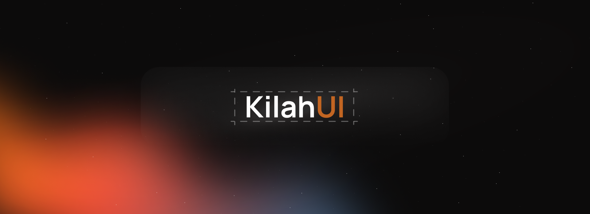
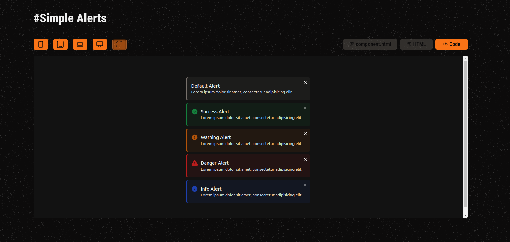
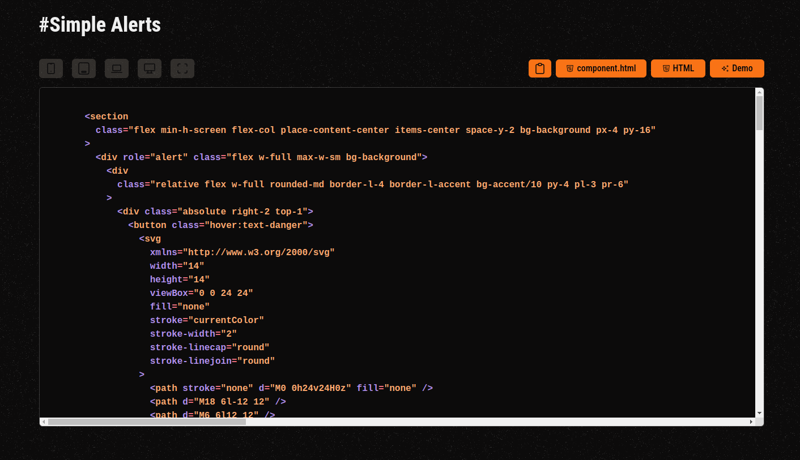

# KilahUI | Free & Open Source | Build Your Website Faster with Seamless Adaptability




KilahUI is inspired by **[hyperui.dev](https://hyperui.dev/)**. Since discovering it, I was struck by how brilliant the idea was and embarked on creating my own version.

This project is **open source**, so feel free to contribute your components! You can read the guide in `CONTRIBUTING.md` or visit the contribute section on the official website at [kilahui.vercel.app/contribute](https://kilahui.vercel.app/contribute).

### Getting Started

KilahUI uses **pnpm** for dependency management. To get started, run:

```bash
pnpm install
pnpm run dev
```

The project runs on **Next.js v15**, and the directory structure is as follows:

```plaintext
public/
    components/       # Codebase for each component
src/
    app/
        (markdown-pages)/  # Pages that use MDX
        [category]/        # Route for each component
        api/               # Route handler for search
        components/        # Components used by the website
        constants/         # Constants
        context/           # Contexts
        hooks/             # Custom hooks
        lib/               # Modules
```

### Custom Colors

One of the first things I set out to do differently was to use **custom colors**. Why? I often found myself modifying colors from TailwindCSS component libraries to fit my theme. So, I decided KilahUI would offer customizable colors to enhance the experience. 

Inspired by **shadcn** and its approach to color declaration, KilahUI also includes easy dark mode support. Below is the default palette used:

```javascript
colors: {
  background: "#ffffff",
  foreground: "#d82116",
  card: "#ffffff",
  "card-foreground": "#d82116",
  primary: "#846bce",
  "primary-foreground": "#e9f1f9",
  secondary: "#e0e9f5",
  "secondary-foreground": "#2d3446",
  accent: "#e0e9f5",
  "accent-foreground": "#2d3446",
  danger: "#e5193e",
  "danger-foreground": "#e9f1f9",
  border: "#d1dce8",
  input: "#d1dce8",
},
```

Each component offers various palettes to demonstrate versatility.

### Playground

Here’s a sneak peek of the **KilahUI Playground**:



On the left, you can define breakpoints, and on the right, you can toggle between the demo and the code. Additionally, you can switch between HTML/JSX and view either the component or the Tailwind configuration used by that component.



There's a search bar to find components by keywords—though I admit naming components wasn't my strongest point 😅.

### Upcoming Features

- **Dark/Light Mode Support**: Not just for the website, but for each component individually.
- **Request-Component Feature**: Users can request components based on design ideas.
- **Analytics**: Planning to integrate tools like PostHog for analytics.

---

Thanks for reading! If you enjoy the project, please consider leaving a star to support its continued development. 🙏✨

Peace out!

---